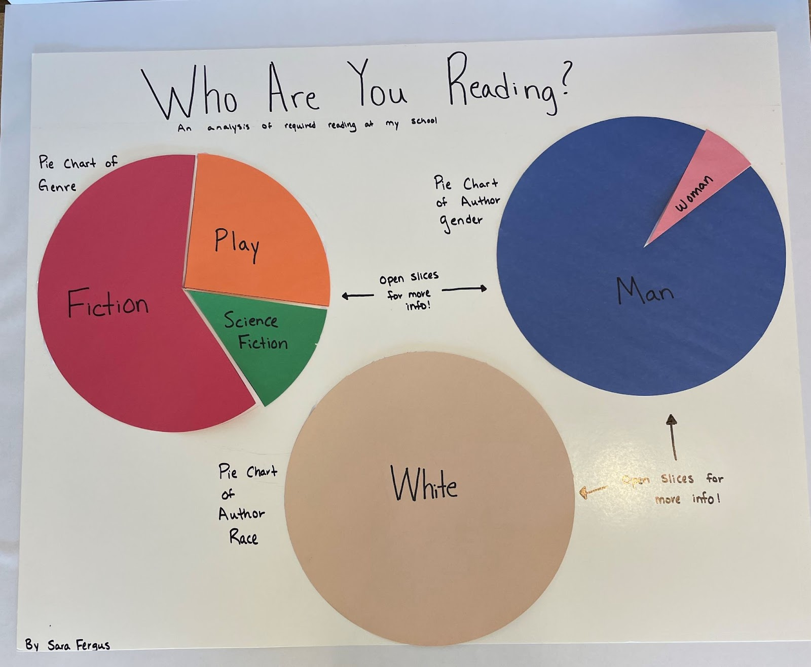
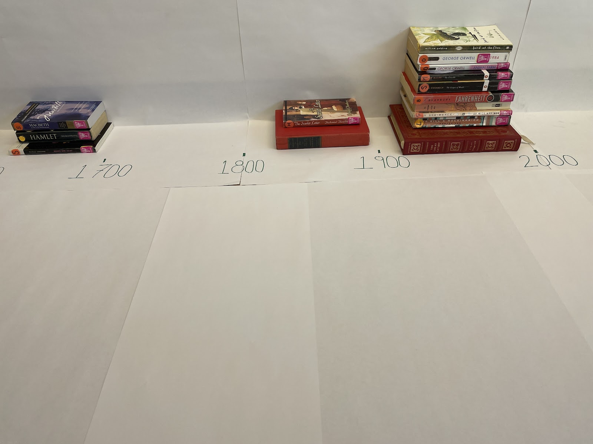
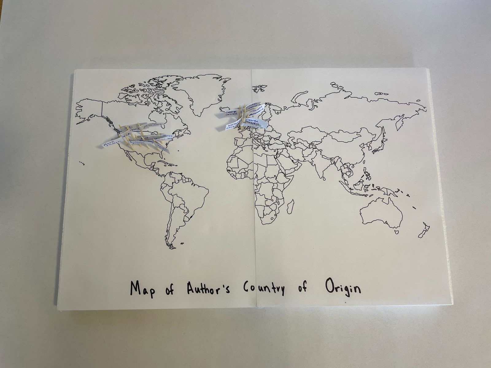
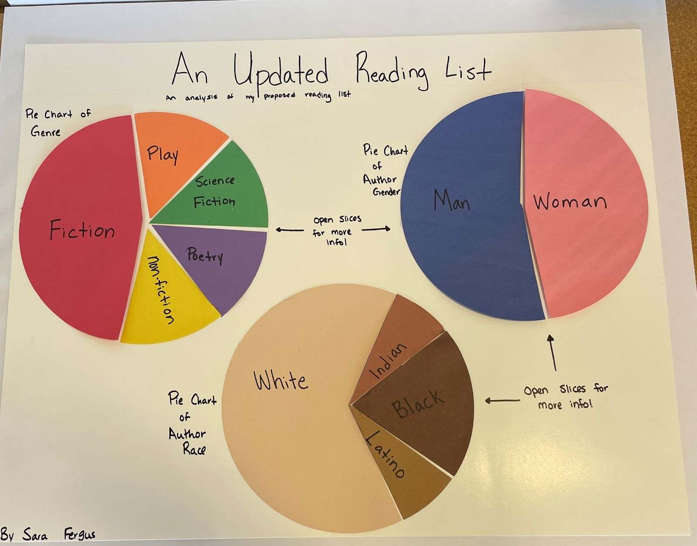
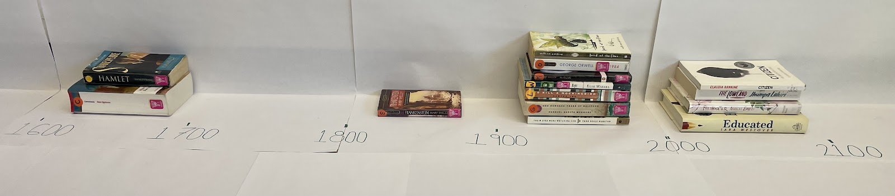
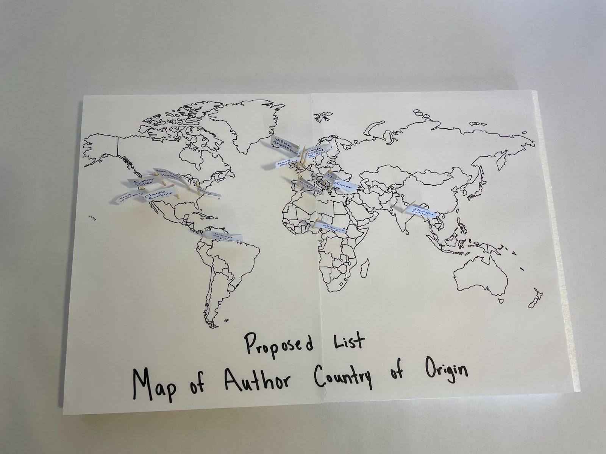

# Required Reading Lists 📖
This project is an unplugged basic exploratory data analysis.
*#unplugged #change-making #local-context #data_cycle #data_science #disruption #physical-visualization #emerging-visualization*

## Classroom Highlights 
This exemplar demonstrates: 
1. Unplugged Data Science
2. Interactive isualization
3. Interactive *and* adaptive visualization
4. Emerging visualization (map)
5. Data Science in a local context
6. A call-to-action in response to findings

In this project, I address the aesthetic perspective of [disruption](http://www.animatingdemocracy.org/sites/default/files/pictures/AestPersp/pdfs/Aesthetics%20Short%20Take.pdf) by taking a critical look at required reading curriculum. 

In this project, I explored the demographics of common required reading books and their authors. In the classroom, a student might choose to do something like this based on their school's required reading lists. This is particulary cool, since placing Data Science in a local context helps students to engage with the material through [place-based learning](https://www.edutopia.org/practice/place-based-learning-connecting-kids-their-community#:~:text=Place%2Dbased%20learning%20engages%20students,their%20work%20in%20their%20community.). In my case, I just used a contrived list of common required reading (They were books shelved as "required reading" on GoodReads). 

I looked at 5 dimensions: genre and year of publication of the book, and race, gender, and nationality of the author. To visualize author race, author gender, and book genre, I created interactive pie charts. When my viewer lifts a slice of the pie they will find the books/authors in that slice. I was lucky to be able to use diverse skin-color construction paper, since it really helps demonstrate the findings. 

To visualized the year of publication of the book, I considered an interactive histogram by stacking books according to century of publication. This allowed the visualization to change as curriculum is changed, and allows students to physically see and [manipulate](https://www.scholastic.com/parents/school-success/homework-help/more-homework-help/math-manipulatives.html) the histogram. It's not *totally* accurate, since the books are different lengths, but I found that the benefits of learning with the manipulatives outweigh the costs. 

Finally, I created a map to explore the author's nationality.

I found that the required reading list I created was missing a lot of diversity, and could use an update. If a student were to do this project, they may stop here with the analysis and proceed to the follow-up. However, if they are "above-and-beyond" students, they may continue. After I explored the data, I created a reading list in an attempt to diversify the curriculum. To ensure that the new list was balanced, I analyzed the new list in exactly the same way. 

The key to exploratory data analysis is the follow-up (this is especially true with [contraversial topics](add link to post). My follow up included a report and a call to action. I explored the reasons why the reading list is not-so-diverse in the first place, and argue that the new list still holds the same important lessons that the traditional one did. I also explored what it might mean to change a curriculum and found that hurdles for teachers is a huge issue (write a whole new curriculum?? No way.) I addressed these issues with some suggestions and resources to help in diversifying. You can check out the whole report here.