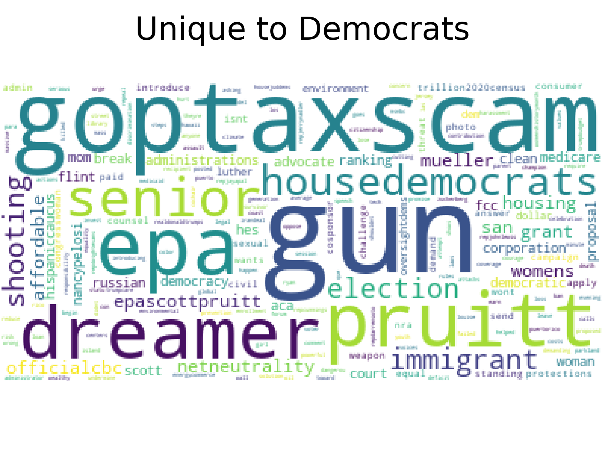
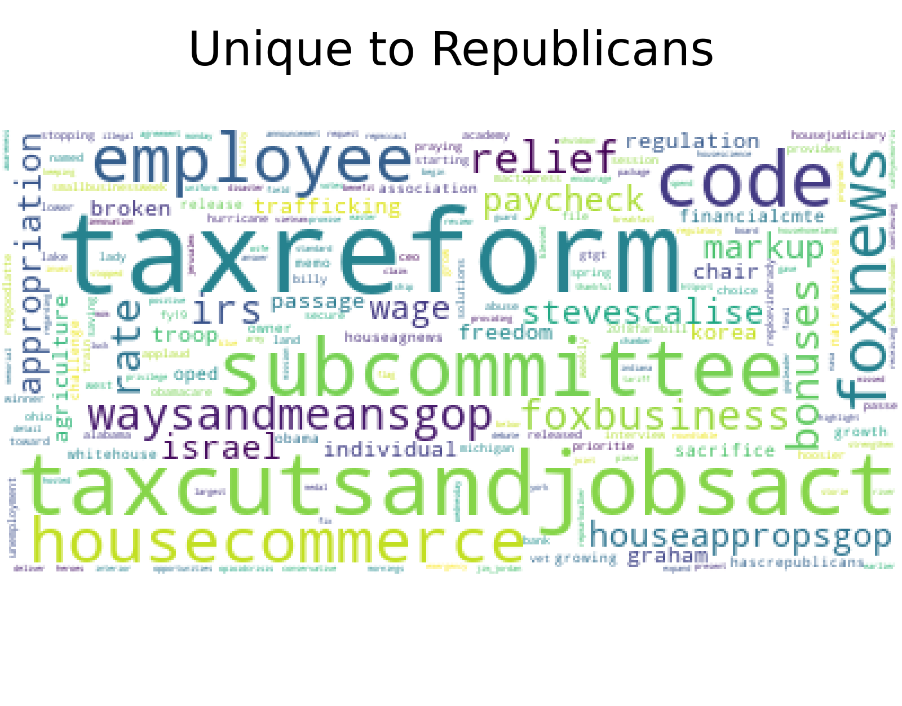
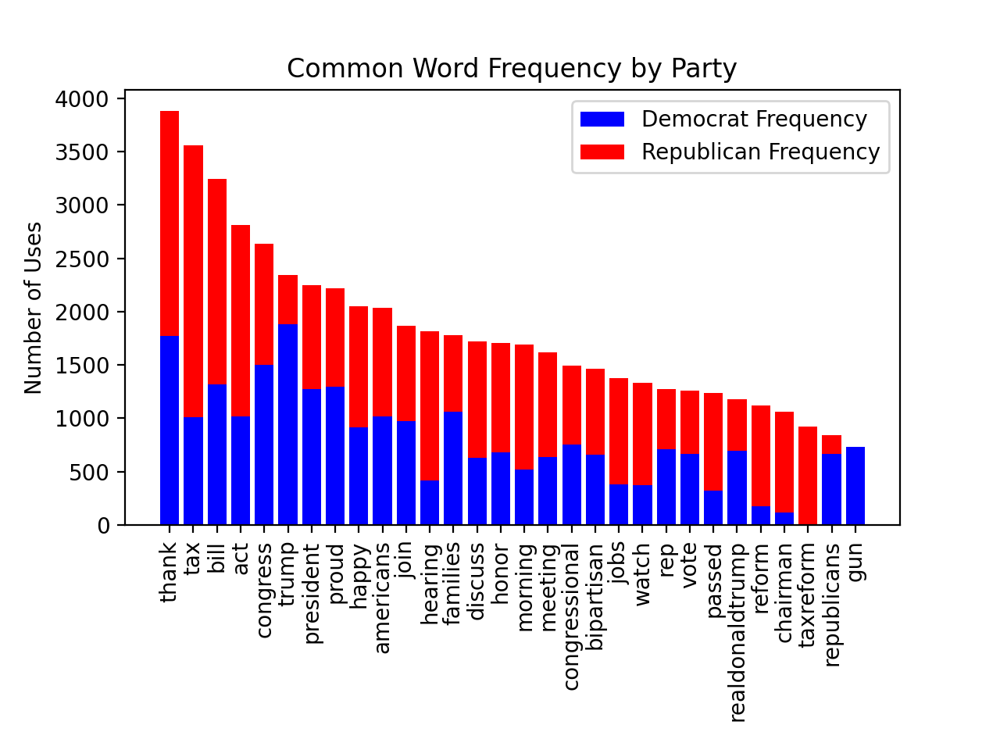

# Political Tweets
*An analysis of the words used in politician’s tweets*
## Research Question and Background
## Data and Data Collection
## Data Analysis 
First, I created word clouds to represent common words used by politicians of either party. In this analysis, I did not include the 500 most common words in the English language (the, and, for, etc), “words” included solely because of the nature of Twitter (https, &amp, RT, etc.), and the 1000 most common words used by the other party. The choice to exclude the 1000 most common words from the other party was two-fold. First, I wanted to exclude words that are often used by politicians in general. For example, politicians all use the word ‘thank’ often, regardless of party affiliation. Second, I wanted to explore what really made the parties different from each other. Words that were in the top 1000 used for one party but not in the top 1000 for the other seemed to be pretty unique to the former party. Figure 1 shows the word cloud I created with the most common words which are unique to Democrats. Larger words represent more usage. Figure 2 shows the results I got when doing the same analysis on the Republican party.

After looking at the unique words, I decided to take a look at generally popular words for politicians, and how those words broke down by party. The result is shown in Figure 3.

## Findings
	When I take a closer look at the word clouds, I notice a few interesting aspects. The first thing I notice is that Democrats tweet about a wide range of different issues. They talk about financial issues (GOP Tax Scam, affordable), gun control (gun, shooting), the environment (EPA), immigration (dreamer, immigration), the political process (pruitt, election), and other notable issues (women, housing, Russia, net neutrality, and more). On the other hand, a large portion of words used by Republicans are related to economic issues. In the word cloud, I see: tax reform, Tax Cuts and Jobs Act, house commerce, employee, paycheck, bonuses, rate, IRS, wage, Ways and Means GOP, and more. While there are words related to other issues (freedom, Israel, Fox News, and more), these words are often used less and appear to be far outnumbered by financially-related words. 
	We see a number of different words used when we explore words which are commonly used both by Republicans and Democrats. A lot of these words are used in similar amounts by each party. A few notable words which are more used by Republicans, however, include tax, hearing, reform, chairman, jobs, watch and tax reform. This mirrors the findings in the word clouds, that Republicans tend to tweet about economic issues. Democrats use words like Trump, families, Republicans, and gun more. This mirrors findings in the word cloud that Democrats have a wide range of issues, but also introduces another trend. While both parties talk about Donald Trump and the Republican Party, Democrats talk about them substantially more. 

## Conclusion
	In my analysis, I looked to answer two major questions. First, which issues are unique to the Democratic party, and which issues are unique to the Republican party? Then, for issues that are not unique to either party but instead are important to everyone, which party is talking about it more? 
	To answer the first question, I visualized the most common words used by Republicans that are not used by Democrats, and vice versa. The major pattern I found was that Republicans are talking about the economy and financial issues a lot, while Democrats are talking about a range of issues. This makes anecdotal sense to me, I often notice Republicans focusing political conversation around money and Democrats sharing concern about a variety of things. In fact, I often hear people describe themselves as a “fiscal Republican and social Democrat”. This makes sense, since these people are likely hearing arguments, which are presumably well-constructed or widely approved of (given the amount of attention given to the arguments) about financial issues by Republicans, and about social issues by Democrats. 
	Then, I created a visualization to look at words which are used by all politicians in my data set. I found a few words that are common: ‘thank’, ‘tax’, ‘bill’, ‘act’, etc. First, it makes sense that these are common words. First and foremost, politicians tend to work to consistently thank their constituents (likely out of some combination of gratitude and dreams of re-election). After that, “bill” and “act” make sense, since they are words used in politics regardless of the issue the bill or act addresses. When we look at more loaded words (tax reform, guns, jobs, etc.), we see a pattern similar to what I found previously: Republicans are thinking about financial issues, Democrats are thinking about a number of different issues. Interestingly, this analysis also uncovered a different pattern. A lot of political tweets talk about former president Donald Trump or about Republicans as a whole. However, these words are far more often used by Democrats. On a brief review, it seems that most of these tweets are critical. For example,  “republicans are using an obscure tactic to stifle debate and democracy in congress”, “republicans voted for the trumpcare monstrosity that would have sent health costs soaring”, and  “republicans need to take a good long look at themselves”. This suggests that Democrats tend to be more vocally critical of their opponents than Republicans. 
	Conclusion
