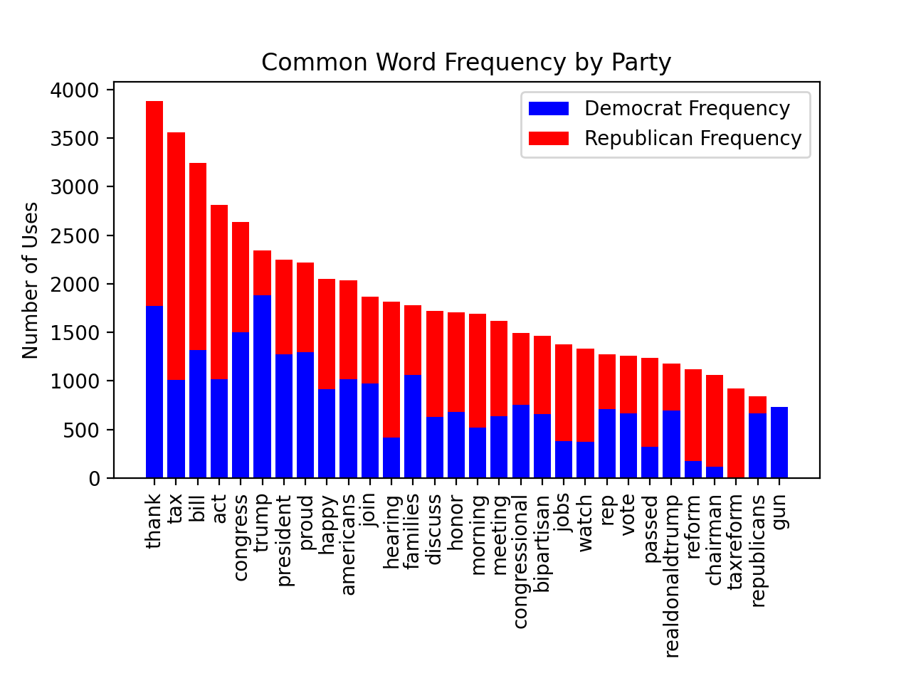

# Political Tweets 🐦
This project is python-based exploratory data analysis.
*#python #data_cycle #data_science  #emerging-visualization*

## Classroom Highlights 
This exemplar demonstrates: 
1. Basic Data Science Python
2. Python Data Science Libraries (`pandas`, `matplotlib`, `wordcloud`, `collections`)
3. Controversial / Poltical topics
4. Data Decisions and Ethics in Representations
5. Emerging Visualizations

In this project, I address the aesthetic perspective of...

## The Project

In this project, I used a dataset of tweets by various members of Congress, sorted by party (I got the tweets from [Kaggle](https://www.kaggle.com/datasets/kapastor/democratvsrepublicantweets)). My goal was to visualize what words politicans used in their tweets, and how those words were different based on the politician's political party. 

An interesting adaptation of this project may be to localize the issues by, for example, examining the tweets of more local politicans.

### Python Libraries
An advantage of Data Science in Python is the many libraries available to use. Often, difficult tasks (such as counting word occurances or creating word clouds) can be simplified using a library. When teaching basic Data Science in Python, I always spend a lot of time training my students to look for and use resources. I explicitly teach students what to google (always include the word "Python"!) and what resources are commonly good to use ([docs.python](https://docs.python.org/3/), [stackoverflow](https://stackoverflow.com/), [w3schools](https://www.w3schools.com/), [geeksforgeeks](https://www.geeksforgeeks.org/), [github](https://github.com/), and others) We start with using the `random` library at the very beginning of the year, when I answer almost every question with "I don't know, did you look at the [documentation](https://docs.python.org/3/library/random.html)?". While this is often met with eye rolls, it communicates to students the importance of using resources, and the idea that you don't need to know everything to be a good programmer. The best programmers are not those who can create everything on their own or know every command, but rather those who can find resources and make sense of documentation. Professional programmers almost always have a documentation tab and a [stackoverflow](https://stackoverflow.com/) tab open.

### Data Decisions
This project is a great example of the importance of basic decisions in data analysis. Once data is selected, a data analysis is largely apolitical. However, choosing a preparing data involves a lot of important decisions. In this project, for example, I made decisions about
* What tweets to include/how many
* What words to leave out (for example, `RT`, which stands for "retweet" was not included. This may have been an interesting consideration if included)
* What how many common words to leave out ("the" makes sense to exclude, but "he" or "go" or "here" may or may not be meaningful)
* How to define findings (for example, my decision to explore words unique to one party, and how I went about determining what a "unique" word is)

Some of these can result in surprisingly major changes in the visualizations. For example, this bar graph is created excluding no common words:

and this is created excluding the 500 most common words:

One may come to very different conclusions based on the data decision made here. Note, for example, that "house", which could be politically meaningful, is included in the first plot, but not the second.

For another example, these are the most common words in tweets by Republicans (excluding the 500 most common words):

And these are the most common "unique" to Republicans excluding the 1000 most common Democratic words:

Again, very different conclusins can be drawn based on a seemingly small data decision. You see the same sorts of changes when looking at the Democrats' words.

While there are ways to optimize these decisions, I tend to only have students consider them informally at the k-12 level.

### Controversial Topics
The key to exploratory data analysis is the follow-up (this is especially true with [contraversial topics](add link to post). I believe that it is important to (almost) never limit a students choice in topic. To support this, I encourage students to critically consider their data decisions, and then follow-up their data analysis in a way that makes no claims besides the clear, data-driven patterns.