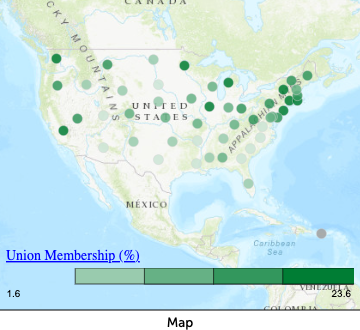

# Unions in the United States 🧑‍🏭
This project is a basic exploratory data analysis in CODAP ([what is CODAP](https://codap.concord.org/about/)?). 
*#null_results #CODAP #measure_of_america #linear_regression #emerging_visualizations #data_cycle #data_science #disruption #controversial_topics*

## Classroom Highlights 
This exemplar demonstrates: 
1. basic visualizations (scatterplot, histogram, box-and-whisker), 
2. modeling with linear regression,
3. an example of an "emerging visualization" (a geographic map)
4. an example of "follow-up thinking",
5. the use of [Measure of America](https://measureofamerica.org/) as a source of data,
6. a null result
7. a controversial topic

This project attempts to address the aesthetic perspective of [disruption](http://www.animatingdemocracy.org/sites/default/files/pictures/AestPersp/pdfs/Aesthetics%20Short%20Take.pdf) by providing insight on a topic that many Virginians do not know a lot about (being that unions are, officially, illegal in the state). 

### A Null Result
Many students will choose to explore relationships that do not actually exist (sometimes, this will be painfully clear to you before your student even starts). This example helps to communicate to students that a weak realationships still provide insight and inquiry, and that they should not be afraid to investigate ideas they do not already know about. 

### Controversial Issues
Officially, unions are illegal in Virginia. So, the topic of unions is very political and relativley controversial. Should I let my students explore a contraversial topic like this? *Absolutley*. I encourage students to study anything they are interested in, and in my experience, they are often interested in political/controversial ideas (racism, enviornmental issues, LGBT+ issues, ...). This requires some closer faciliatation and some more discussion, but is absolutley possible and, personally, encouraged. I expand on this more in [my post on faciliating projects on controversial topics.](link) 

## The Project

In this project, I explore labor unions using data from the wage data of [Measure of America](https://measureofamerica.org/). I explored the relationships between a states percent of union participation and other measures of well-being. To start, I visualized unions in the country using an *emerging visualization*, a geographic map. 

[Measure of America](https://measureofamerica.org/) has a *lot* of data. An advantage of using technology like [CODAP](https://codap.concord.org/) is that I could look at a lot of different measures fairly quickly and easily. So, a student would be able to start from a place where they know nothing about the topic. With some extra exploration faciliated by technology, they can narrow down their questions as they go. 

I found that, at an initial exploratory analysis phase, weak relationships ($r^2$ between $.2$ and $.4$) exist between union participation and four measures: minimum wage, state GDP, public assistance expenditure, and median earnings. 
<iframe width="600px" height="393px" frameborder="no" scrolling="no" allowfullscreen="true" webkitallowfullscreen="true" mozallowfullscreen="true" src="https://codap.concord.org/app/static/dg/en/cert/index.html#shared=https%3A%2F%2Fcfm-shared.concord.org%2FDECvm0vmbfBFQoUUw7dH%2Ffile.json"></iframe>

At this point, I practiced [*follow-up thinking*](link). I explored two follow up questions: the role of race and the role of gender in the relationship between unions and median earnings. When broken down by either variable, the $r^2$ values fall below $.2$. 

In my write up, I attempted to reconcile the lack of concrete findings in this report with the overwhelming research pointing to a realtionship between unions and well-being. This required follow-up research, as well as multiple forms of questioning:

* Is there something flawed in my data that leads me to find a result different than what the research says?
* Is there something flawed in my data analyis that leads me to find a result different than what the research says?
* Is there another factor that can be affecting my findings? (Throughout the write-up, I considered confounding variables, but I didn't do any formal analysis of them. In an introduction to Data Science, it is more important to spend time on the ideas than the techniques, so I often wait to talk about how to analyze confounding variables until my students have completed a number of Data Science projects.) 
* Is the question one that can be fully answered with Data Science?

Answering "no" to any of those questions doesn't make this a bad project, it just teaches the process of data analysis and encourages students to think critically. Whether the answer to those questions are yes or no, I always encourage students to ask questions based on their results and consider where differences may come from, both on their own and formally in a write-up.

You can see the whole CODAP document [here](https://codap.concord.org/app/static/dg/en/cert/index.html#shared=https%3A%2F%2Fcfm-shared.concord.org%2F70tjQ9UEmM3u8VsN0cP0%2Ffile.json). You can check out the whole report here.

### Off-Task or Critical Thinking?
My data questioning led me to an interesting side question: what is the spread of earnings by race and gender? [CODAP](https://codap.concord.org/) allowed me to briefly explore that idea. 

While I wouldn't include it in the final analysis, asking questions and searching for answers is something that we want to encourage in our students. When my students are working on projects, I keep this in mind when I am circling around. In a 90 minute class period of work time, I need to be prepared for students to spend some time academically off-task (asking side questions) and some time non-academically off-task (brain breaks). Part of project-based learning is teaching students the benefits of this off-task time, but helping them to balance.

